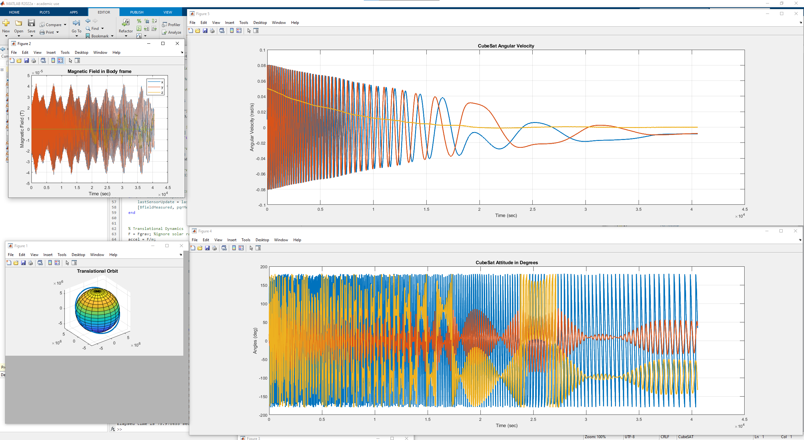
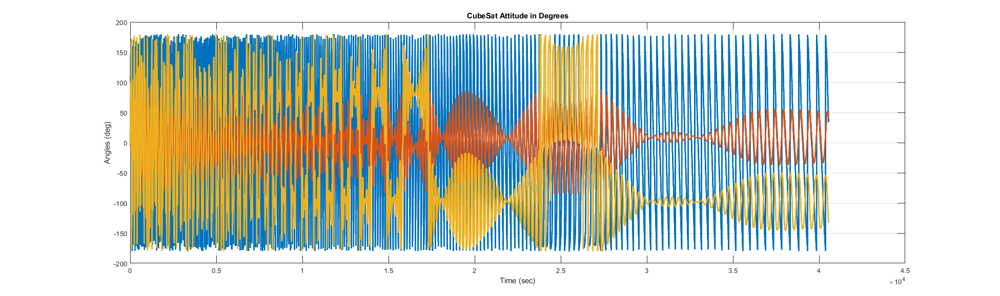

# Attitude Determination and Control Systems Simulations for 3U CubeSAT

 
    

 
    

 
    

ADCS Simulation for ACRUX-2 CubeSAT mission for the Melbourne Space Program, referenced resource from Aerospace Mechanics and Controls - Carlos Jose Montalvo
